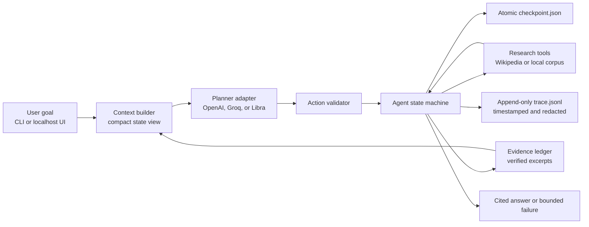
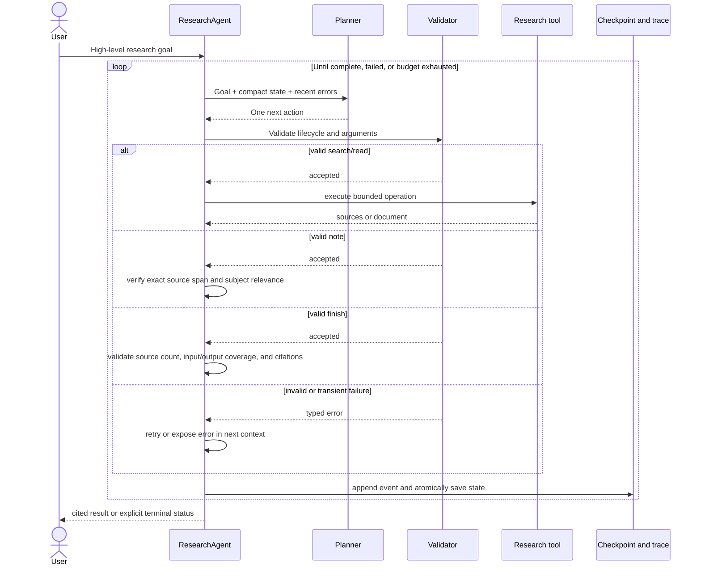

# System design and architecture

The design is intentionally one process and one agent loop. The language model proposes research content; deterministic Python code owns state transitions, tool access, evidence admission, retry policy, checkpoints, and terminal conditions.

## Component architecture

The API key crosses from the browser to the localhost server for the selected run. It is retained only in the active process call and is excluded from state, checkpoints, traces, status responses, and browser storage.

Optional, separate development-only paths read the durable outputs without joining the decision loop: `/metrics` aggregates checkpoint counters for Prometheus and Grafana; `evals/run_qa.py` checks saved answer/trace invariants and can invoke DeepEval as an external judge or publish content-free QA scores to Langfuse. Neither path can choose actions or amend a completed answer.

## Decision and recovery sequence

## Persisted versus transient data

| Persisted | Process memory only | Sent to the model |
|---|---|---|
| Goal, source metadata, read/abandoned IDs, admitted evidence, recent errors, counters, quality checks, answer; UI mode/provider/model in separate non-secret run metadata | API key, full retrieved pages, active HTTP objects, UI thread state | Goal, ranked source metadata, bounded relevant extracts, admitted evidence, progress, last three errors |

Full pages are not placed in checkpoints. A resumed run re-fetches previously read, non-abandoned pages and reconstructs only the bounded context needed for the next decision. The UI discovers only safe, single-directory run IDs with valid checkpoints and non-secret run metadata; completed and currently active runs are not offered for resume.

## Failure boundaries

- Transport failures receive bounded retry and backoff without consuming a logical agent step.
- Provider errors are classified as rate-limit, generation, quota/authentication, or server failures.
- Invalid actions and unsupported final answers become planner-visible validation errors.
- Final answers must cover explicit goal concepts; claim-level citations are enforced when requested, while evidence-word overlap is logged only as a heuristic.
- Three identical unrecoverable errors open the circuit.
- The logical step budget prevents endless but varied behavior.
- Every iteration writes observable state before the next decision.
